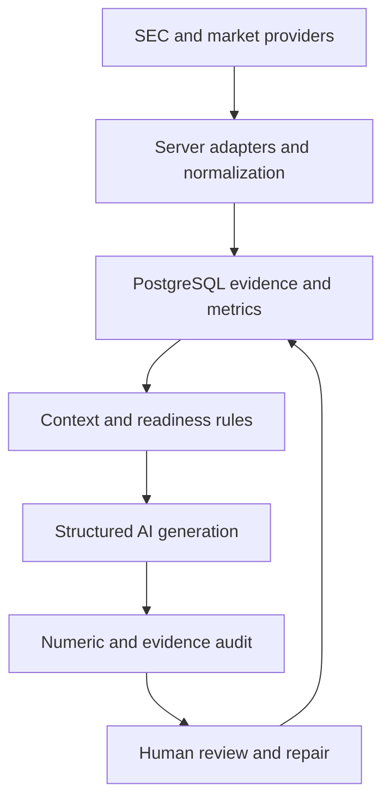

# Architecture

The React workspace calls TanStack server functions. Server adapters ingest filings and market data into PostgreSQL. Database-bounded context carries source IDs, claim IDs, and metric keys into generation. Audit and readiness modules provide deterministic checks alongside model-assisted review; they do not guarantee factual correctness.

## Implementation map

| Area                 | Files under `src/`                                                                                                             |
| -------------------- | ------------------------------------------------------------------------------------------------------------------------------ |
| Authentication       | `integrations/supabase/auth-middleware.ts`, `integrations/supabase/auth-attacher.ts`, `integrations/supabase/client.server.ts` |
| SEC ingestion        | `lib/sec.server.ts`, `lib/sec.sync.server.ts`, `lib/sec/mapping.ts`                                                            |
| Indian data          | `lib/indianapi.server.ts`, `lib/indianapi/mapping.ts`                                                                          |
| Discovery            | `lib/discovery/scoring.ts`, `cluster.ts`, `run.server.ts`                                                                      |
| Evidence pipeline    | `lib/research/evidence.server.ts`, `orchestrator.server.ts`, `traceability.ts`                                                 |
| Completion           | `lib/research/completion.ts`, `readiness.ts`, `aigates.ts`                                                                     |
| AI contracts         | `lib/openai.server.ts`, `lib/ai/schemas.ts`                                                                                    |
| Bounded context      | `lib/ai/context.server.ts`, `script-context.server.ts`                                                                         |
| Composition          | `lib/ai/multi-script.server.ts`, `multi-script-schemas.ts`                                                                     |
| Numeric auditing     | `lib/ai/precheck.server.ts`, `lib/content/numeric.ts`                                                                          |
| Temporal auditing    | `lib/content/temporal.ts`                                                                                                      |
| Readiness and repair | `lib/ai/longform-readiness.ts`, `audit.server.ts`, `repair.server.ts`                                                          |
| Server errors        | `server.ts`, `lib/error-page.ts`                                                                                               |

## Tradeoffs

Provider coverage and freshness limit output quality. Deterministic matching can flag ambiguous expressions; a reviewer remains necessary. The database and server enforce a single provisioned owner per installation. Global uniqueness, singleton settings, execution keys and provider budgets are deliberately not presented as collaborative multi-tenancy. The standard Nitro configuration replaces the original platform build wrapper; deployment target and secrets must be configured for the chosen host and validated independently.

## Authorization flow

The browser uses a publishable client under forced RLS. Private record predicates combine matching `user_id`/`auth.uid()` with the installation-owner RPC. System/audit/reference tables have no browser write grants.

A server-function request first verifies its Auth token with a public-key client. The owner RPC then approves the caller before AsyncLocalStorage opens a privileged server scope. The service client requires this scope, and server-only module boundaries keep it out of browser bundles. Server operations can maintain system/audit records; ownership triggers and foreign keys require all private rows to belong to the sole provisioned owner. New authenticated accounts have no application permissions.

The private owner registry is provisioned only through database-owner tooling. It is not a browser enrollment endpoint. The authorization migration refuses old populated projects; automatic reassignment of shared data is unsafe. See [authorization matrix and migration details](DATABASE_AUTHORIZATION.md).
